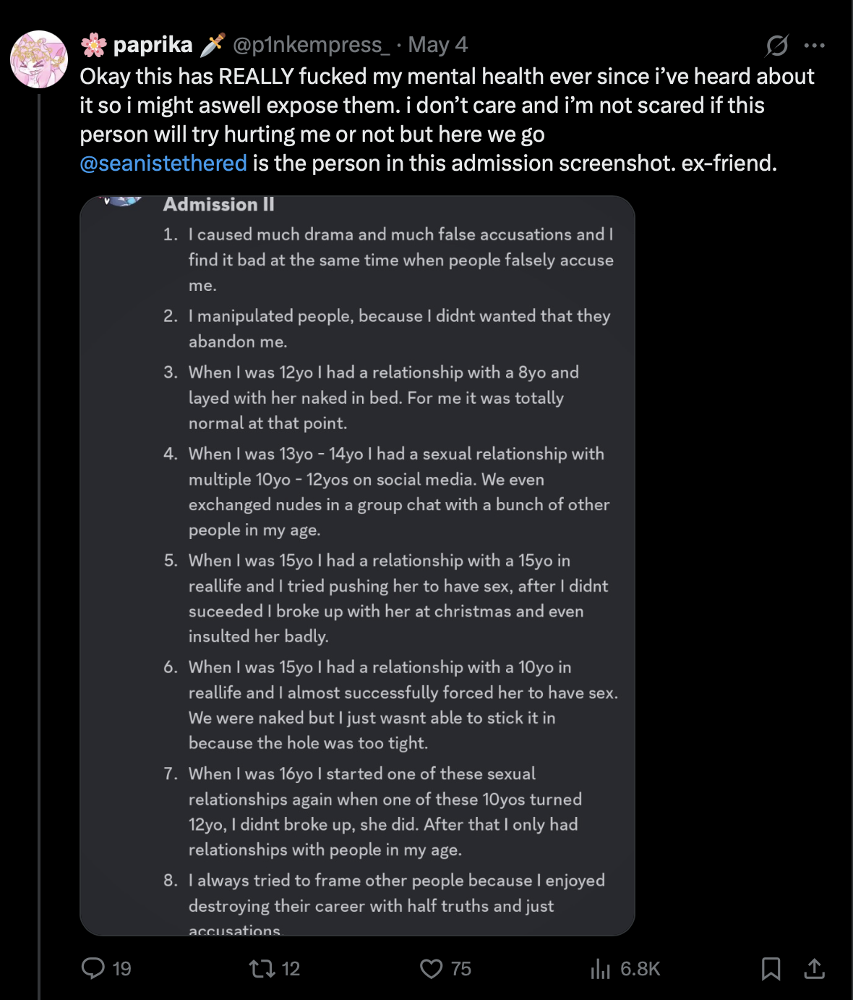
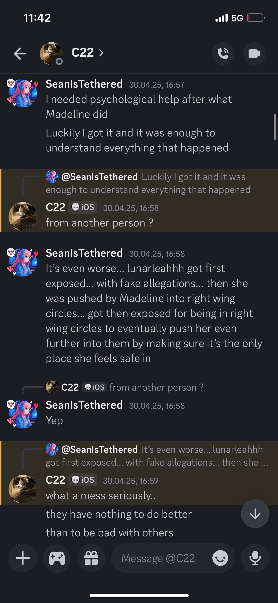

# (Logic and evidence vs noise and "evidence") against SeanIsTethered

First of all I wanna apologize for everything that has happened and I will analytically make a statement to everything.

You have to read everything to understand what happened. Its necessary if you dont read all of this then also dont hate or cancel him.

Written by Lindsey.

> No matter how many accusations exists, they do not count as proof. It's based on facts. So instead of counting voices the evidence on Sean should be examined objectively. If he is guilty then it should show in the facts and not in the noise.

## Admission Screenshots

### 2nd Admission first

In this screenshot we see [the main exposed screenshot posted by paprika against Sean](https://x.com/p1nkempress_/status/1919071331175329960). We can see her presenting a screenshot as proof by stating that its a admission written by Sean without having had the proof for this claim. She did not say that she assumes that its a admission.

Sean already admitted of writing this one in his [document](https://drive.google.com/file/d/1oeiTBmnBURNbiYjmA0aepCaZa9J3nCcl/view?usp=share_link) although he said that he lied about him self to make everyone hate him. Which is possible with his diagnosis such as ADHD, Borderline and Autism. Here is what I found in my long-term research. I will also highlight the points that matter the most.

**1. BPD**

**People with BPD often struggle with**:

- Intense emotional dysregulation
- Self-hatred or chronic feelings of emptiness
- **Impulsive or self-destructive behaviors**
- Extreme fear of abandonment

**In moments of acute distress or identity collapse, someone with BPD might**:

- **Feel they deserve to be hated or punished**
- **Confuse guilt/shame with reality**
- **Say things to confirm a distorted self-image (e.g., "I'm a monster")**
- **Act in ways that push people away to confirm their internal narrative**

**2. ADHD**

**ADHD can contribute to:**

- **Impulsivity** in speech and behavior
- Difficulty with emotional regulation
- **Executive function challenges** (making it harder to pause and reflect before speaking or acting)

**3. Autism**

**Autistic individuals may**:

- **Interpret social dynamics in atypical ways**
- Struggle with nuance in communication
- **Be highly suggestible or vulnerable in high-pressure or emotional contexts**

**4. Loosing Everything & Wanting rejection**

If someone looses something that important such as their friend circle with the conditions mentioned above they may enter a state:

- **Punishment feels deserved**
- **They believe being hated is a form of justice**
- **They confess things to reinforce their self-loathing or to “make things worse” intentionally**

> Note: He is in active psychological treatment to learn to deal with these problems.

With the given psychological state of Sean all of this is given. I can understand that many people are very emotional in that situation given the points in the admission although Sean stated that he wrote them falsely which makes sense. Especially when we dig deeper and read the full context.

### 1st Admission

In this one we can see that the admission is well structured and has much information which Sean also confirmed of being 100% true, but also under conditions. I've talked with Sean in the last days a lot and here is what I have to say. We are going to itterate through each point:

1. Yes this is true, although here is a big catch. First of all these two minors were in the same age. They were in a relationship(Sean and the minor girl) but they were in the same age which was 15. There is a little issue because Sean is from germany and the girl is from Poland and the age of consent would only allow it in germany to be legal, but I dont see it as a big deal as there was no age gap. Hate me for this take but yeah. Sean got influenced by [SparkleChan](#SparkleChan) which was a very evil person according to Sean him self. He said that she manipulated all people and pinged everyone sexually on his server back then when it was big. She had his trust and she abused his trust by manipulating him into doxxing that girl that was in his age for the alleged cheating SparkleChan mentioned to Sean. How much this is true we cant know. There was also more to it. Sean got accused of having doxxed that girl because she didnt played along with his fantasies which is a assumption as no proof for this claim was ever been provided. This is the same girl that says that he is a rapist, a sexual abuser, etc while that is illegal because Sean was never convicted.
2. This point is a little bit tricky but also not entirely Seans fault. He has certain diagnosis which explain this behaviour but that doesnt justify it. He was new to poly relationships and he misdealt the act of having favourites. People often told him when he requested something more of someone else than of Amber that he knows that and that he does it to harm her although not true to what i heard of. Amber her self stated that she doesnt see it as abuse(we cannot find the chat part of that, so that does not really count but I assume it happened). Even when sean catched predators one of ambers partners told him to stop and to go to amber while this predator could of gotten more children which he got by the way because they told them to stop catching them at that evening. This also adds up to those things as he stated to me "This was also one of the reasons I said that I raped children, because I wasn't able to prevent it from happening when someone else did it." Which he felt additionally guilty for. Sean has catched many predators in the past which also extends his knowledge tremendously about those crimes. He even caught someone who leaked nudes of their 15yo ex girlfriend and handed the case over to the FBI.

<table>
  <tr>
    <td></td>
    <td></td>
  </tr>
</table>

3. The Racism was commited, although under the conditions that Aquarius previously told him many bad things such as that their grandpa should hit him till he cannot have sex anymore with a girlfriend he found that was older than him self(just saying not that it can be pulled out of context). Aquarius utilised traumas in order to damadge Sean which Sean then needed to combat he did it with one statement and even saw the issue and straight corrected him self. Additionally Aquarius did it because he felt jealous that he does have a girlfriend. Aquarius is also not innocent according to Sean. Sean says that Aquarius who is 21 years old sexualised a 16 year old girl in a voice chat while Sean was in that voice chat, while he instructed Aquarius to not continue Aquarius just said that its a joke although making really weird sexual statements towards that minor.

   <table>
     <tr>
       <td></td>
       <td></td>
       <td></td>
       <td></td>
     </tr>
   </table>

5. Nothing to add. NoOp.

6. Nothing to add. NoOp.

Additionally we can see clearly that the 2nd admission was written way faster than the other one which suggests mental instability.

## SparkleChan

> "SparkleChan is Sean"

This is a common hate slang in the jailbreak community when people talk about Sean. There is no proof to prove that.

SparkleChan was 14 when entering the jailbreak community and approached Sean in a online group with AppInstalleriOS, they talked about a new great idea. They wanted to create Xcode for iOS. SparkleChan did start with the project as **Swifty** and then it developed into SparkCode. After that they found out that she leaked nudes of a 14 year old on twitter in the past and immediately banned her from the team. She tried to come back multiple times and tried to act like Sean in order to pull him with her down because she was jealous about him being the new maintainer of **SparkCode** which developed into **FridaCodeManager** which then developed into **Nyxian**.

Thats the truth and the claim that "SparkleChan is Sean" is very weak.

## Falsely accused by a company

This is another chat snippet between the communication of paprika and Sean. The statement of Sean is solid. You just have to go to the r/Sideloaded discord server which partners with KravaSign which is the company mentioned in the screenshot. He got accused with the same LunarLeahhh thread. And he got falsely accused, because it is not proven what the information states on that thread.

## LunarLeahhh thread

This thread was originally posted by Ashley(formerly known as Madeline) because she thought she was fighting for the right people but she was wrong. She apologized to Sean on discord and we can show you that. She wanted to have LunarLeahhhs account Sean didnt want to let that happen and Madeline pushed him out of his own friend circle which caused by the way the condition mentioned above at the child abuse admission [screenshots](#Admission-Screenshots).

<table>
  <tr>
    <td></td>
    <td></td>
    <td></td>
    <td></td>
  </tr>
  <tr>
    <td></td>
    <td></td>
  </tr>
</table>

The entire view of what happened in the situation also...

<table>
  <tr>
    <td></td>
    <td></td>
    <td></td>
    <td></td>
  </tr>
  <tr>
    <td></td>
    <td></td>
    <td></td>
    <td></td>
  </tr>
  <tr>
    <td></td>
    <td></td>
    <td></td>
    <td></td>
  </tr>
</table>

So we can see after we read this why Sean was even in that situation and I understand him more and more when I read this.

## Transphobia

Sean is not transphobic anymore but was it in the past like 2 years ago. He improved from that condition and shows support to the LGBTQ community. The only thing he still dislikes is LGBTQ baiting.

## Conclusion

After we read that we come to the conclusion that Sean has many difficult mental illnesses but we can also see that he never commited any actual crimes here. From the facts we see here.
